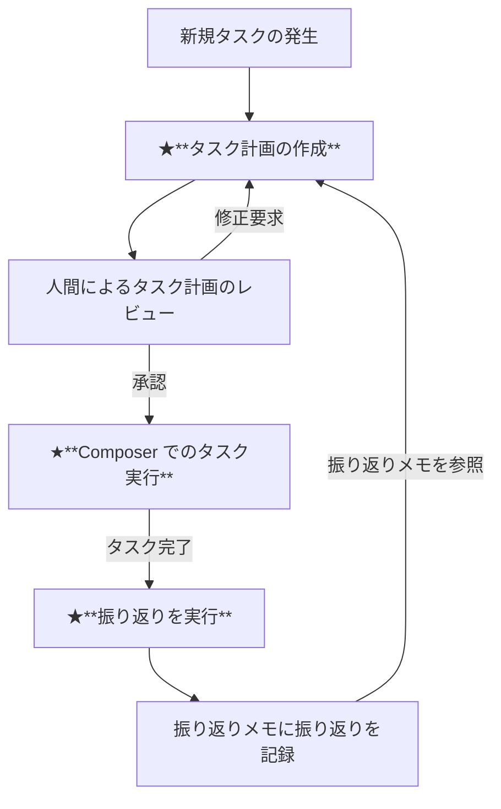

## はじめに

前回は [Cursor の Project Rules 活用と改善](https://zenn.dev/globis/articles/cursor-project-rules) という記事を書かせていただきました。

今回は、私自身が普段実施している、より具体に迫った Cursor の活用方法をお伝えしようと思います。

私と私のチームのメンバーの一部が活用し始めた手法であり、すべてのPJでワークする確証はないため、ネタ枠の気持ちでお読みいただけると嬉しいです。

また、私が一から考案したものというよりは、X や Cursor の Forum で議論されていた内容を、抽象化し、実践に落としたものです。(※参考文献を参照)

私の関わっている中規模程度のプロジェクトにおいても、とりわけバックエンド開発（Rails + GraphQL）においては、今回の手法を使い、8~9割ほどのコードは Cursor で生成されたものを使うことができています。

手法の一つとして、参考になる部分があれば幸いです。

## Cursor と振り返りとは？

この記事では、Cursor の Composer を用いてタスクを実行した後、そのタスクを Composer と振り返り、次回以降のタスク計画に活かすというフローをお伝えします。

Cursor などの AI エディターでは、プロジェクト全体のドキュメントを整備することで大きな力を発揮しやすくなりますが、プロジェクト規模が大きくてドキュメントを完全に用意することができないケースも多いと思います。

今回のフローにて、振り返りを通じ、徐々にプロジェクトでの最良の振る舞いを身に着けていくことを目指します。

## 事前準備

Project Rules を2つ、タスクの計画/進捗管理をさせるメモ帳代わりのマークダウンファイル、長期の記憶領域としてのマークダウンファイルの、計4ファイルをリポジトリ配下におきます。

ファイルの内容は、gist にしましたので、適宜コピペしてお使いください。

[gist はこちら](https://gist.github.com/tanukiti1987/e4b1198ad611fcf962d4e01aa18d2d11)

私の場合、以下のように配置しています。

```
.
├── .cursor
│   ├── rules
│   │   ├── memories-management.mdc
│   │   └── scratchpad-management.mdc
│   ├── scratchpad.md
│   └── memories.md
```

### scratchpad.md(タスク計画書)

以降、scratchpad.md は「**タスク計画書**」と呼びます。

このファイルは以下の役割を持ちます。

- （Composer）暫定的なタスクの計画を立てる
- （人間）タスク計画をレビューする
- （Composer）承認をもらったタスクを順次遂行する

このやり取りをさせるために、Chat や Composer のセッションだけにとどまらない、ファイルを用意しています。

**暫定的なタスクが完了したり、最初からやり直す場合には、このファイルの内容をリセットする必要してください。**

### scratchpad-management.mdc

タスク計画書にタスクを記載したり、タスクを遂行することに関するルールです。

タスク計画書を更新する際には Composer にこのルールに従うよう指示をします。

内容はファイルの通りですので、説明は割愛します。

### memories.md(振り返りメモ)

以降、memories.md は「**振り返りメモ**」と呼びます。

このファイルは以下の役割を持ちます。

- Composer の一つのセッションでやり取りし、次回以降のタスクをより良くするためのメモをする
- タスク計画書を用いてタスク計画をするときに、このファイルの内容を取り出し、よりよい計画を立てさせる

このファイルを持っておかない限り、Composer で指摘した事項は Project Rules に残すか、 `@Summarized Composer` を使って明示的に過去の Composer のコンテキストを参照しない限り、1つのセッション内でコンテキストは失われてしまいます。

それを防ぐ為に、このファイルを用意しています。

### memories-management.mdc

このファイルは、振り返りメモを更新するときのルールです。

振り返りメモを更新する際には Composer にこのルールに従うよう指示をします。

内容はファイルの通りですので、説明は割愛します。

## フロー図

以下のフロー図は、タスク計画書と振り返りメモを活用したワークフローを示しています。(★の部分を後ほど詳しく解説します)



このワークフローでは、振り返りメモに蓄積された知見を活かしてタスク計画書でタスク計画を立て、実行させています。

タスク完了後は Composer とやり取りについて振り返りを実施し、次のタスクに活かすという循環を作ります。

これにより、Cursorは徐々に「学習」し、より適切なコード生成ができるようになります。

## タスク計画の作成

タスク計画では、Project Rules も参照させながら、Composer の agent モードで計画を立てさせます。

`プロンプト例`
```
@scratchpad-management.mdc に従って、以下のタスクをスクラッチパッドにまとめて。
また、タスクを分析・検討するときに @memories.md も確認し、過去のタスク実行時の知識も活用して。

確信度が95%になるまで、不足している点は何度でも質問して。
なお、確信度については一度計算した後、本当にその精度が正確性を疑い、厳し目に再計算してください。

-----
{{ここに具体的なタスクの内容}}
-----

## 注意事項

- 計画が完了した時点で確認をとること
- 実装をすぐに始めないこと
```

### 解説

- Project Rules に定義したファイルを直接呼び出しているのは、ルールを確実に参照させるための工夫です
- 確信度は、Composer が勝手に判断します
  - 具体的なタスクを指示したとしても、Composer が不足している点があると判断した場合には、低めの確信度がつき、追加の質問をしてくれます
- 質問に応対しながら、確信度を高めたり、不足している点や誤っている点を指摘していくことで、タスク計画をより良いものにしていきます

## Composer でのタスク実行

ここでは Composer の agent モードの作業を眺めることが我々の仕事になりますが、以下の点に注意してください。

- 計画から逸れてしまったり、思い通りのコードを生成しなかったとしてもなるべく手動でコードを修正せずに、Composer に指示を出すこと

あとは、Composer がうまくやってくれることを祈りましょう。

## 振り返りを実行

無事にタスクが完了したら、同一の Composer のセッション内で、以下のように振り返りを実行します。

タスク実行時になるべく Composer に指示を出すようにしているので、指示を出した数だけ、振り返りも実り多い時間になるはずです。

`プロンプト例`
```
今回の一連のタスクを経て @memories-management.mdc に従い、 @memories.md に保存しておく知識について振り返ります。

- 計画時点ではうまくいくと思っていたが、うまくいかなかったこと
- ユーザーの指示により、新たな発見があったこと
- エラーや不具合が発生し、解決したこと

これらを洗い出したうえで、私に対して、残しておくべき知識を提案してください。

提案が了承されたら @memories-management.mdc に従い、@memories.md に追記してください。
```

### 解説

- 振り返りで出してきた内容は、優しい気持ちで Accept してあげましょう
  - よほど誤った解釈をしていない限り、私は Composer の振り返りを承認しています（それが、私にとって”重要”と感じなくても）
- Composer が出した振り返りに不足を感じる場合には、自分の言葉でもフィードバックを行い、それも振り返りメモに残しましょう
  - 「`@memories-management.mdc` に従って、xxx を追記して」と伝えればOKです

## 最後に

以上が、Cursor と振り返りをして自走力を高める取り組みになります。

振り返りメモが蓄積されるほどに、タスク計画時点で、「振り返りメモのこれを使います」という出力も表示され、振り返りが着実に効いてくるようになります。

このフローを取り入れた開発を取り入れた初期には、あまり恩恵を感じないかもしれませんが、回を重ねるごとによいコードを書いてくれる感じがしてくると思いますので、お試しされる際には、少し長め（10セッションほど）にお試ししてもらえるとよいかと思います。

また、今回紹介したフローは Composer を多用するので、Premium Request を多く消費します。

私自身はあまり気にしないようにしていますが、Premium Request を節約したい方にはあまりオススメはできません。

一方で、このフローは AI との対話感があり、同じドキュメントを見ながら作業や振り返りができるため、よりペアプロ感が高まり、楽しいと感じることができています。

ぜひ、試していただき、うまくいった部分、うまく行かなかった部分などもコメントに残していただけると嬉しいです。

## トラブルシューティング

- Q: タスク計画をして、レビューを挟まずに実装に進んでしまう
  - A: タスク計画のレビューに回答したときに起こりやすいです。 レビュー中の都度のやりとりでも、「実装はしないでレビューさせて」と伝えると落ち着くことがあります
- Q: タスク計画を脱線して、作業を進め始めてしまった！
  - A: 一度タスクを止め、タスク計画のどこの部分から実行し直してほしいかを明示しましょう
- Q: 振り返りで Composer が出してきた内容が的を得ていないように感じる
  - A: Composer が出してきた内容は誤りではない限り受け入れ、自分自身の観点からの補足をいれてみてください
- Q: Chat でタスク計画を立てて、Composer に実行させたほうが良いのでは？
  - A: 小規模なタスク、自明なタスクは、その手法が良いと思います。全てのタスクを今回紹介するやり方でやる必要はありません

## 参考文献

- [Rules for ultra context, memories, lessons, scratchpad with plan and act modes](https://forum.cursor.com/t/rules-for-ultra-context-memories-lessons-scratchpad-with-plan-and-act-modes/48792)
- [You are using Cursor AI incorrectly...](https://ghuntley.com/stdlib/)

## 付録

昨今の生成AIでは、"記憶"を与えることで、より良いコードを出力ができる。といったような事例が多く出てきています。

- Windsurf の [Memories](https://docs.codeium.com/windsurf/memories)
- Cline の [Memory Bank](https://docs.cline.bot/improving-your-prompting-skills/custom-instructions-library/cline-memory-bank)
- OpenAI の [Memory](https://openai.com/index/memory-and-new-controls-for-chatgpt/)

今はまだ Cursor は Memory を持ち合わせていませんが、いずれは機能として取り込まれることを願っています。


